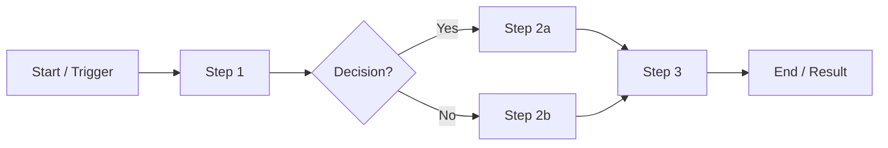
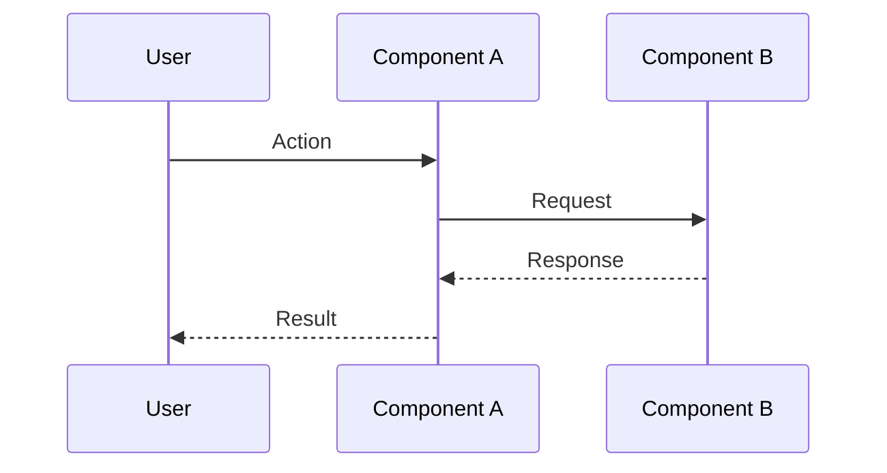
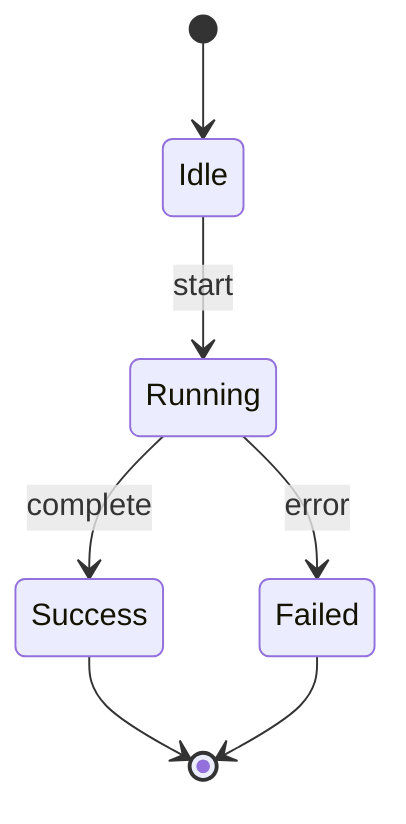

# App Flow

Generic template for documenting the app's flow. Replace the placeholders below with the real steps, components, and states.

## 1. Overview

One or two sentences describing what this flow accomplishes and who/what triggers it.

## 2. High-level flow

```
[Trigger] -> [Step A] -> [Step B] -> [Step C] -> [Result]
```

## 3. Diagram



## 4. Sequence



## 5. States



## 6. Steps in detail

| Step | Component | Input | Output | Notes |
|------|-----------|-------|--------|-------|
| 1 | | | | |
| 2 | | | | |
| 3 | | | | |

## 7. Error / edge cases

- Case:
  - Handling:
- Case:
  - Handling:

## 8. Open questions

-
