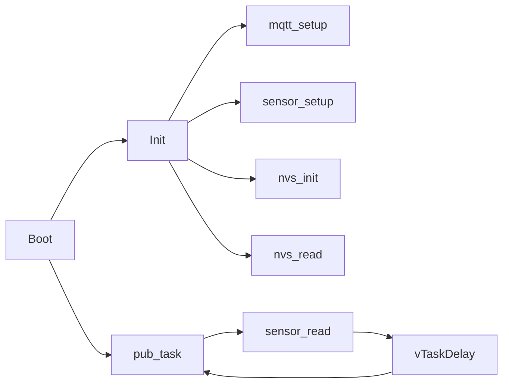

```mermaid
flowchart LR
    A[Boot] --> B[Init]
    B --> C[mqtt_setup]
    B --> D[sensor_setup]
    B --> E[nvs_init]
    B --> F[nvs_read]
    A --> G[pub_task]
    G --> H[sensor_read]
    H --> I[vTaskDelay]
    I --> G[pub_task]
```